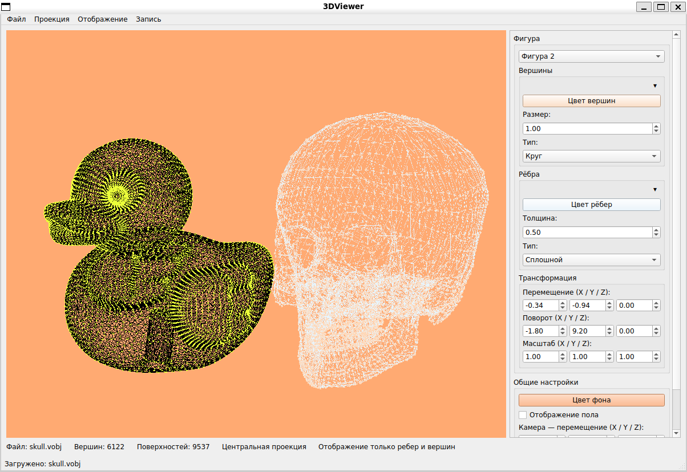
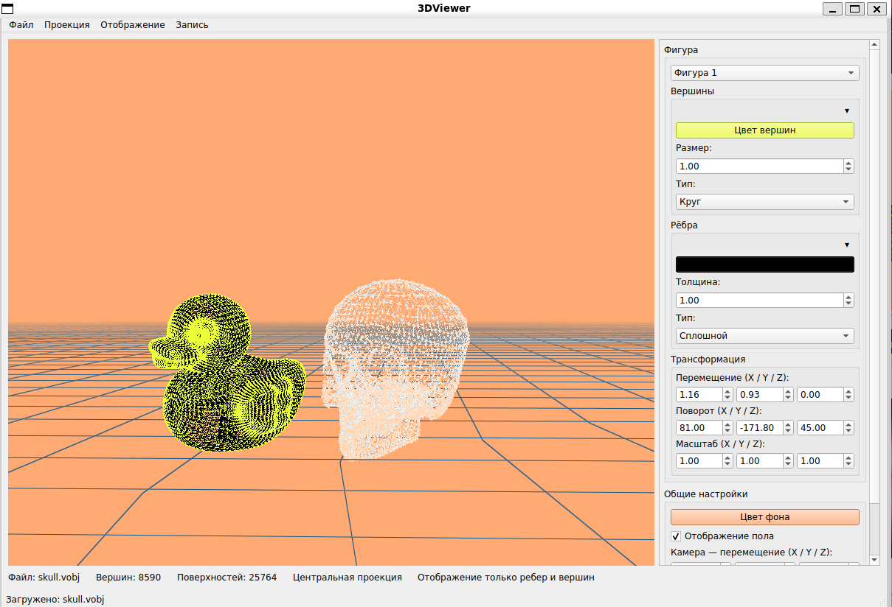
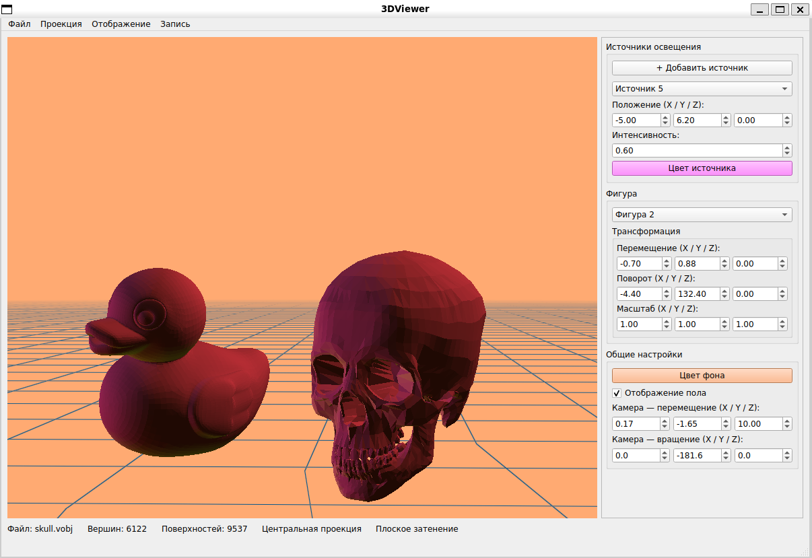
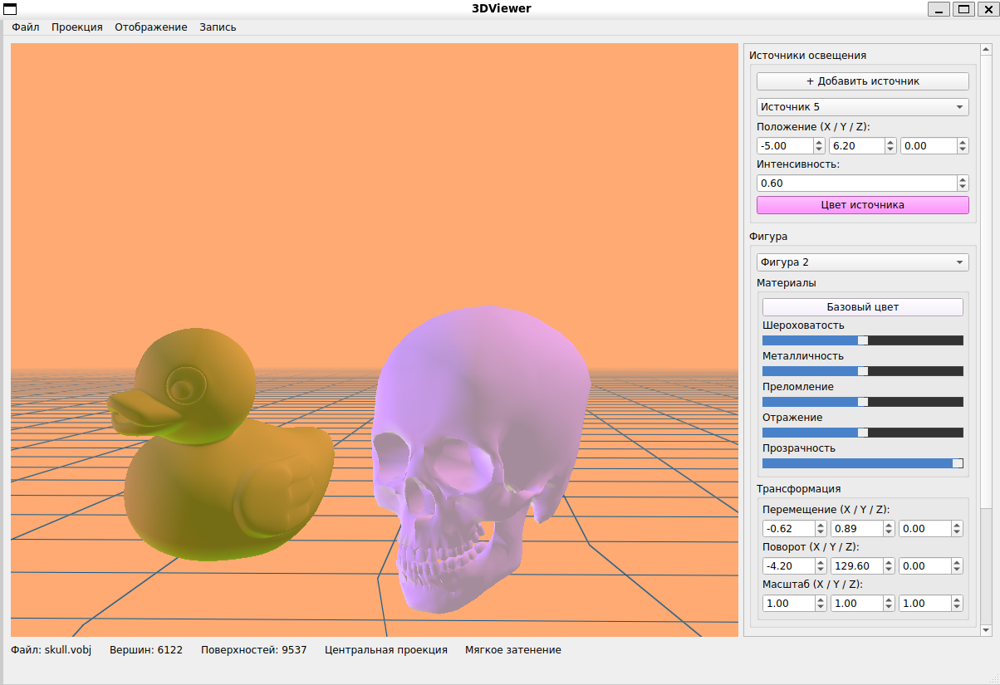
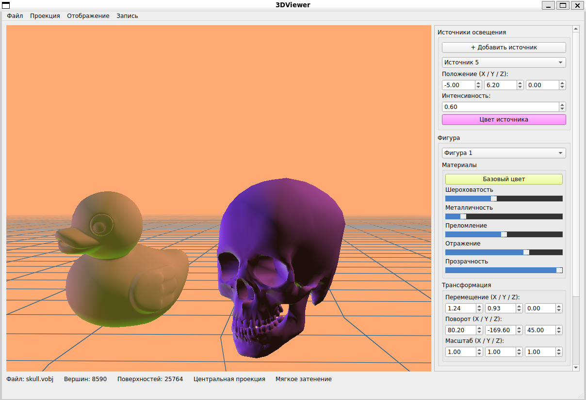
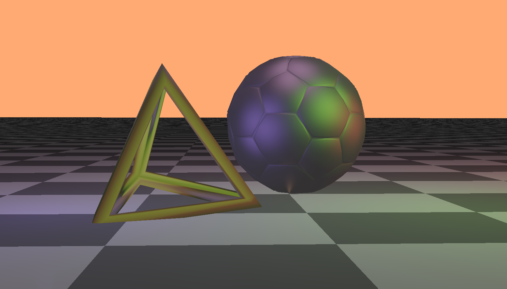
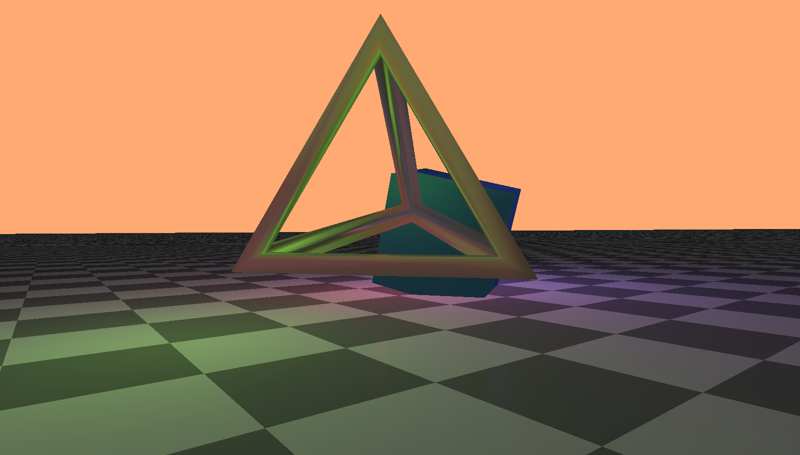

# 3DViewer

Программа разработана для визуализации 3D объектов на экране через загрузку из файла

## ОБНОВЛЕНИЕ 2.2
- Добавлена поддержка до 5 фигур, которые могут одновременно находится на сцене
- Переработано взаимодействие со светом: на сцене находится один фоновый и до 5 направленных источников освещения
- Функционал камеры вынесен в отдельный класс
- Добавлены материалы для фигур
- **Добавлено освещение с помощью трассировки лучей**
- Добавлено отображение пола
- Каждый вид отрисовки сцены вынесен в отдельную шейдерную программу
- Добавлен предпросмотр созданного скриншота в окне диалога

## Версия 2.1

Поддерживаемый функционал:
- Изменение цвета, размера и способа представления вершин
- Изменение цвета, размера и способа представления ребер
- Изменение цвета фона
- Изменение проекции (ортографическая/параллельная)
- Настройка положения и цвета базового источника освещения
- Выбор типа представления фигуры через отдельное действие в верхней части меню
- Различные типы освещения (плоское и мягкое)
- Управление мышью

## Пример работы программы

- Две модели в каркасном режиме


- Те же самые модели, только с включенной сеткой пола


- Фигуры уточки и черепа в режиме плоского затенения


- Фигура уточки и черепа в режиме мягкого затенения с заданными материалами


- Задаем другие материалы:


- Мяч и тетраэдр, отрисованные с помощью трассировки лучей. Изображение сделано с помощью действия Запись -> Скриншот


- Тетраэдр и куб, отрисованные с помощью трассировки лучей


## Установка необходимых пакетов
Чтобы приложение заработало, необходимо установить следующие инструменты:

Debian/Ubuntu
```bash
sudo apt install libfontconfig1-dev libfreetype-dev libgtk-3-dev libx11-dev libx11-xcb-dev libxcb-cursor-dev libxcb-glx0-dev libxcb-icccm4-dev libxcb-image0-dev libxcb-keysyms1-dev libxcb-randr0-dev libxcb-render-util0-dev libxcb-shape0-dev libxcb-shm0-dev libxcb-sync-dev libxcb-util-dev libxcb-xfixes0-dev libxcb-xkb-dev libxcb1-dev libxext-dev libxfixes-dev libxi-dev libxkbcommon-dev libxkbcommon-x11-dev libxrender-dev

sudo apt install cpp g++ gcc build-essential libgl1-mesa-dev cmake ninja-build
```

## Сборка проекта

Скопировать код из репозитория
```bash
git clone https://github.com/exodess/3DViewer.git
```

Чтобы установить программу, необходимо ввести команду:
```bash
cmake -S . -B build
cmake --build build --target 3DViewer
```

И запустить:
```bash
./build/3DViewer
```

Если необходимо удалить программу, то
```bash
rm -rf build
```
