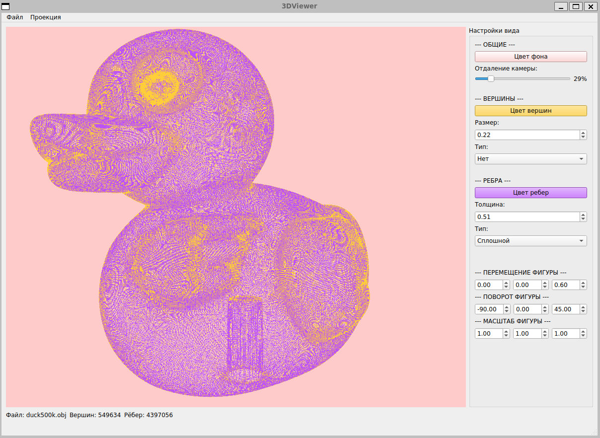
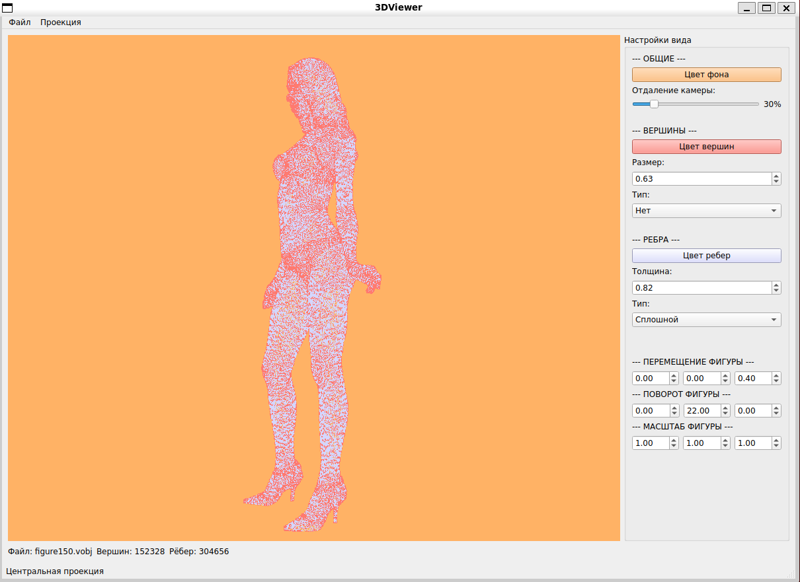

# 3DViewer

Программа разработана для визуализации 3D объектов на экране
Отрисовывает только ребра и вершины

Поддерживаемый функционал:
- Изменение цвета вершин
- Изменение размера вершин
- Изменение способа отображения вершин (нет/круг/квадрат)
- Изменение цвета ребер
- Изменение размера ребер
- Изменение способа отображения ребер (сплошная линия/пунктир)
- Изменение цвета фона
- Изменение проекции (ортографическая/параллельная)

## Пример фигур

- Фигура уточки


- Фигура девушки


- Как фигура выглядит вблизи:


## Установка необходимых пакетов
Чтобы приложение заработало, необходимо установить следующие инструменты:

Debian/Ubuntu
```bash
sudo apt install libfontconfig1-dev libfreetype-dev libgtk-3-dev libx11-dev libx11-xcb-dev libxcb-cursor-dev libxcb-glx0-dev libxcb-icccm4-dev libxcb-image0-dev libxcb-keysyms1-dev libxcb-randr0-dev libxcb-render-util0-dev libxcb-shape0-dev libxcb-shm0-dev libxcb-sync-dev libxcb-util-dev libxcb-xfixes0-dev libxcb-xkb-dev libxcb1-dev libxext-dev libxfixes-dev libxi-dev libxkbcommon-dev libxkbcommon-x11-dev libxrender-dev

sudo apt install cpp g++ gcc build-essential libgl1-mesa-dev cmake ninja-build
```

## Сборка проекта

Скопировать код из репозитория
```bash
git clone https://github.com/exodess/3DViewer.git
```

Чтобы установить программу, необходимо ввести команду:
```bash
make install
```

И запустить:
```bash
make run
```

Если необходимо удалить программу, то
```bash
make uninstall
```
