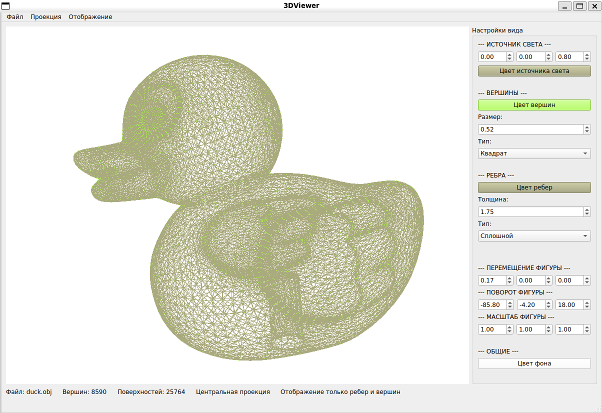
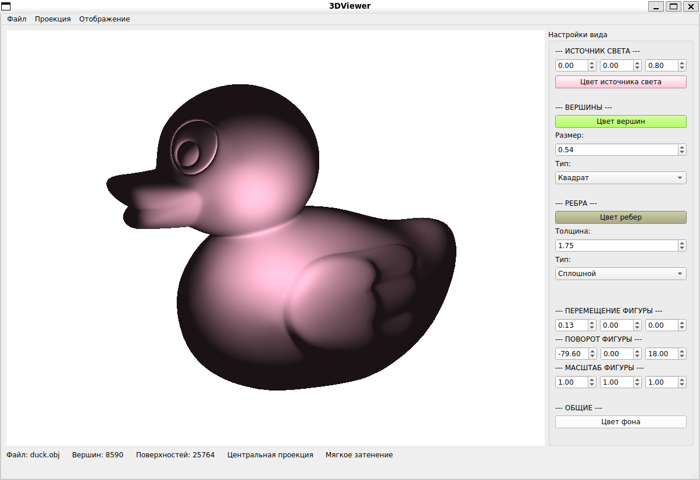
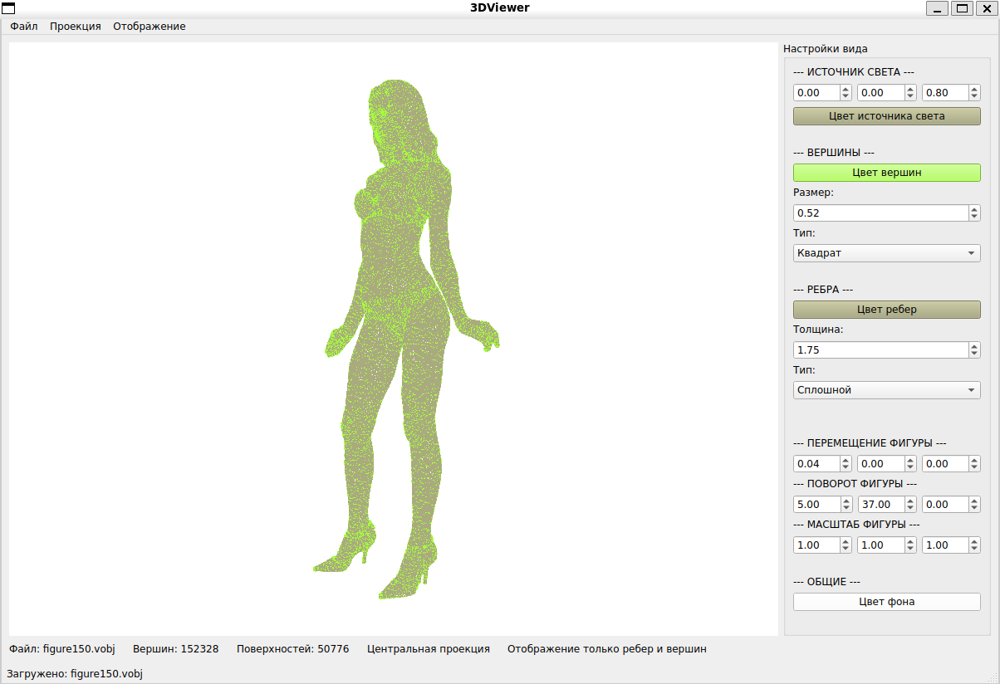
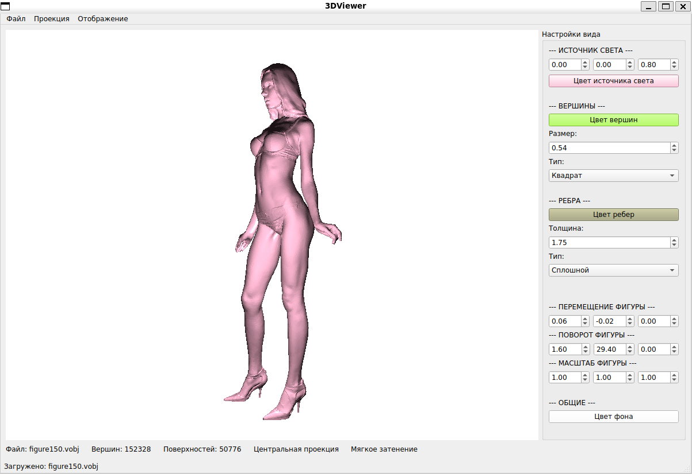
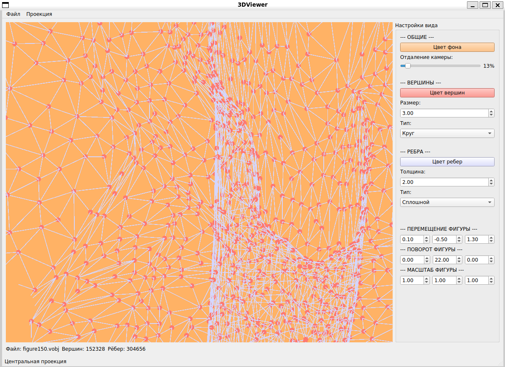
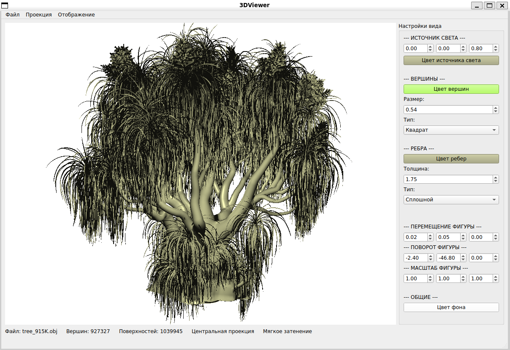

# 3DViewer

Программа разработана для визуализации 3D объектов на экране через загрузку из файла

## Версия 2.0

Поддерживаемый функционал:
- Изменение цвета вершин
- Изменение размера вершин
- Изменение способа отображения вершин (нет/круг/квадрат)
- Изменение цвета ребер
- Изменение размера ребер
- Изменение способа отображения ребер (сплошная линия/пунктир)
- Изменение цвета фона
- Изменение проекции (ортографическая/параллельная)

## ОБНОВЛЕНИЕ 2.1

1. Добавлен базовый источник света, возможность настраивать его положение и цвет
2. Добавлен выбор типа представления фигуры через отдельное действие в верхней части меню
3. Добавлено плоское и мягкое освещение
4. Переработана боковая часть интерфеса, удален ползунок регулировки масштаба
5. Добавлено управление мышью

## Пример работы программы

- Фигура уточки в режиме каркасной модели


- Фигура уточки в режиме плоского затенения


- Фигура уточки в режиме мягкого затенения


- Фигура девушки в режиме каркасной модели


- Фигура девушки в режиме затенения


- Как фигура выглядит вблизи в режиме каркасной модели


- Многополигональная фигура дерева в режиме затенения


## Установка необходимых пакетов
Чтобы приложение заработало, необходимо установить следующие инструменты:

Debian/Ubuntu
```bash
sudo apt install libfontconfig1-dev libfreetype-dev libgtk-3-dev libx11-dev libx11-xcb-dev libxcb-cursor-dev libxcb-glx0-dev libxcb-icccm4-dev libxcb-image0-dev libxcb-keysyms1-dev libxcb-randr0-dev libxcb-render-util0-dev libxcb-shape0-dev libxcb-shm0-dev libxcb-sync-dev libxcb-util-dev libxcb-xfixes0-dev libxcb-xkb-dev libxcb1-dev libxext-dev libxfixes-dev libxi-dev libxkbcommon-dev libxkbcommon-x11-dev libxrender-dev

sudo apt install cpp g++ gcc build-essential libgl1-mesa-dev cmake ninja-build
```

## Сборка проекта

Скопировать код из репозитория
```bash
git clone https://github.com/exodess/3DViewer.git
```

Чтобы установить программу, необходимо ввести команду:
```bash
cmake -S . -B build
cmake --build build --target 3DViewer
```

И запустить:
```bash
./build/3DViewer
```

Если необходимо удалить программу, то
```bash
rm -rf build
```
